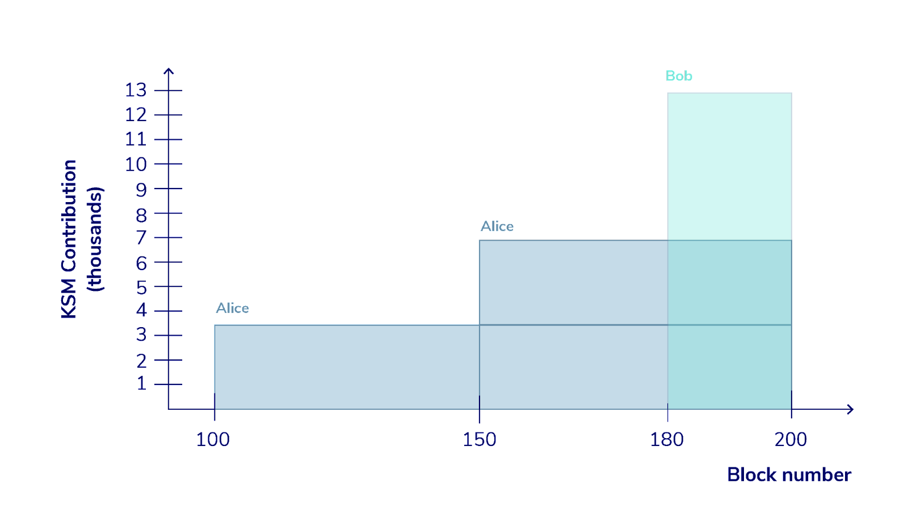
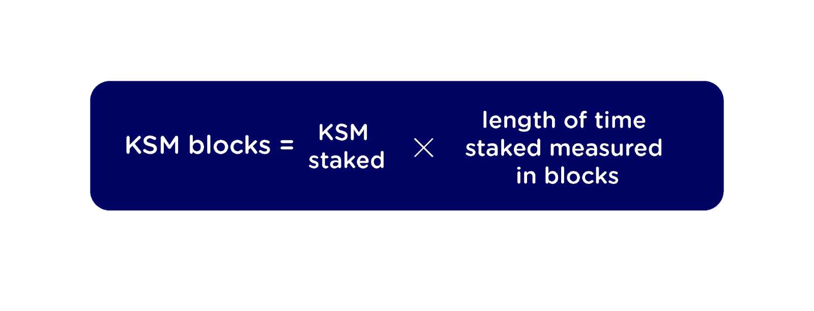
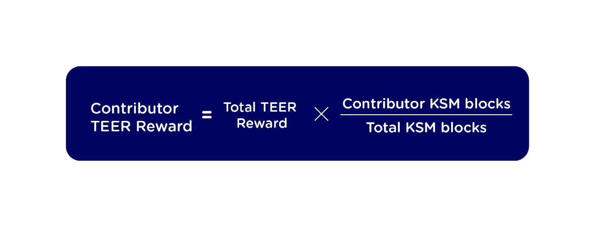

# Tools for Reward Calculations

A few helpers to fetch contributions and calculate rewards. First of all, we need the raw list of individual contributions to our crowdloan campaigns.

## fetch crowdloan contributions

Only repeat this if there are new contributions. the result of ended campaigns is added to this repository for convenience, so you don't need to run it again unless for verification.
Integritee has been running the following fund id's: 24, 38

```
./fetch-contributions.py <fund index> <subscan api key>
```

## Winning Crowdloan Rewards

For our winning Kusama crowdloan with fund id 59, you can reproduce allocations with:

```
./reward_calculation.py 59
```

For privacy reasons, we do not disclose the referral data. So you'll have to supply an empty file with

```
touch referrals-2015-59-bn.csv
```

## Guaranteed Rewards

During the past 2 crowdloan campaigns, we have offered guaranteed rewards to Integritee backers, regardless of whether Integritee won an auction or not. Our backers reached some of the milestones necessary to access guaranteed rewards, which means we will pay out 20,000 TEER for each crowdloan campaign, a total of 40,000 TEER. 

Below, we would like to further clarify how these rewards will be allocated.

In addition to encouraging participation, these rewards incentivized backers to support Integritee and back us early — the more DOT you have bonded and the earlier you bonded it, the more TEER you will be entitled to receive. We believe that this is the fairest way to compensate backers for the opportunity cost of staking their tokens. Thus, the guaranteed rewards you receive are based on two factors:

* The amount of DOT you contribute.
* The length of time your DOT is staked, measured in blocks.



To understand how this works in practice, consider the simple example illustrated above. For simplicity, let’s assume that there are just two backers, Alice and Bob. Alice makes two contributions of 3,500 DOT at Block 100 and Block 150 respectively, whereas Bob contributes 13,000 DOT closer to the finish, at Block 180. The crowdloan ends at Block 200 with 20,000 DOT staked in total. Thus, 20,000 TEER in Guaranteed Rewards will be distributed to Alice and Bob. 

For each contribution by each backer, the total number of staked DOT blocks is calculated as follows:



Thus, Alice’s DOT blocks for her two contributions will be:
(3,500 DOT x 100 blocks) + (3,500 DOT x 50 blocks) = 525,000 DOT blocks

Whereas Bob’s DOT blocks for his contribution will be calculated like this:
13,000 DOT x 20 blocks = 260,000 DOT blocks

Finally, once we know the DOT blocks for each backer, their Guaranteed Reward is calculated using this formula:



Thus, Alice’s total reward can be calculated as follows:
20,000 x (525,000 / 785,000) = 13,376 TEER  

While Bob’s total reward is calculated like this:
20,000 x (260,000 / 785,000) = 6,624 TEER

Note that although Bob staked 13,000 DOT and Alice only staked 7,000 DOT in total, Alice received a higher TEER reward because she backed Integritee earlier and for longer than Bob. In this way, Alice was compensated for her opportunity cost in supporting the campaign. 

### Compute All Rewards 

To calculate all guaranteed rewards for all contributors for both crowdloan campaigns so far, run

```
./guaranteed_reward_calculation.py 24
./guaranteed_reward_calculation.py 38
```
The resulting TEER rewards will be written to `guaranteed-rewards-2015-24.csv` or `guaranteed-rewards-2015-38.csv` where contributors can lookup their allocation. 

The explanatory example above is also implemented for reference. See `contributions-2015-0.csv` to see the input data and  run: 
```
./guaranteed_reward_calculation.py 0
```
And verify that the example above is indeed correctly calculated


# Lottery Rewards

To calculate who qualifies for the time-slot based lottery draw, run the following script against a recent contributions dump csv

```
./lottery_filter_contributions.py
``` 
